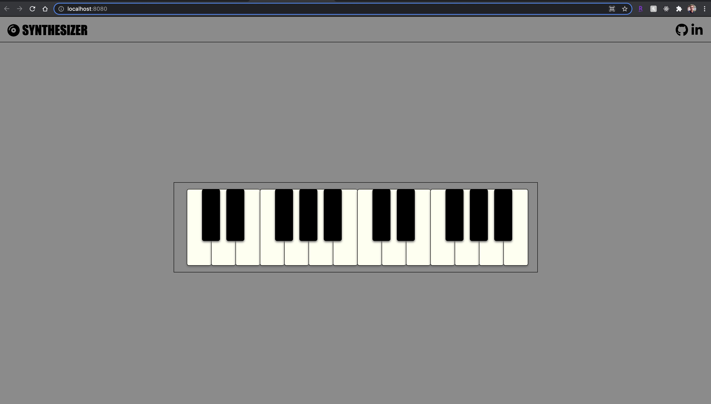
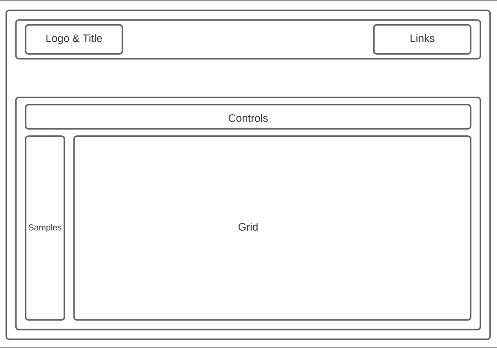

# Syntezator-JS-project
 This is a digital synthesizer app based on Tone.js (Web Audio API library). A synthesizer is an electronic musical instrument that generates audio signals. Users can play melodies using a standard QWERTY keyboard or mouse.

Tone.js is a very popular Web Audio API library 
The Web Audio API provides a powerful and versatile system for controlling audio on the Web, allowing developers to choose audio sources, add effects to audio, create audio visualizations, apply spatial effects (such as panning) and much more.
 

## Architecture and Technologies
* JavaScript
* HTML
* CSS
* Tone.js

## Wireframes
  
This app will consist of a single screen, displaying a virtual copy of a standard piano keyboard (two octaves from C4 to B5), menus for adjusting tone, and links to github and linkedin.

## Upcoming Features
The following is a list of additional features I would like to add to the site in the future:

More sound kits
* Option to play chords 
* Create controls that alter timbre
* Create Drum Sequencer
* Option to customization that remaps keys to desired pitch sets
